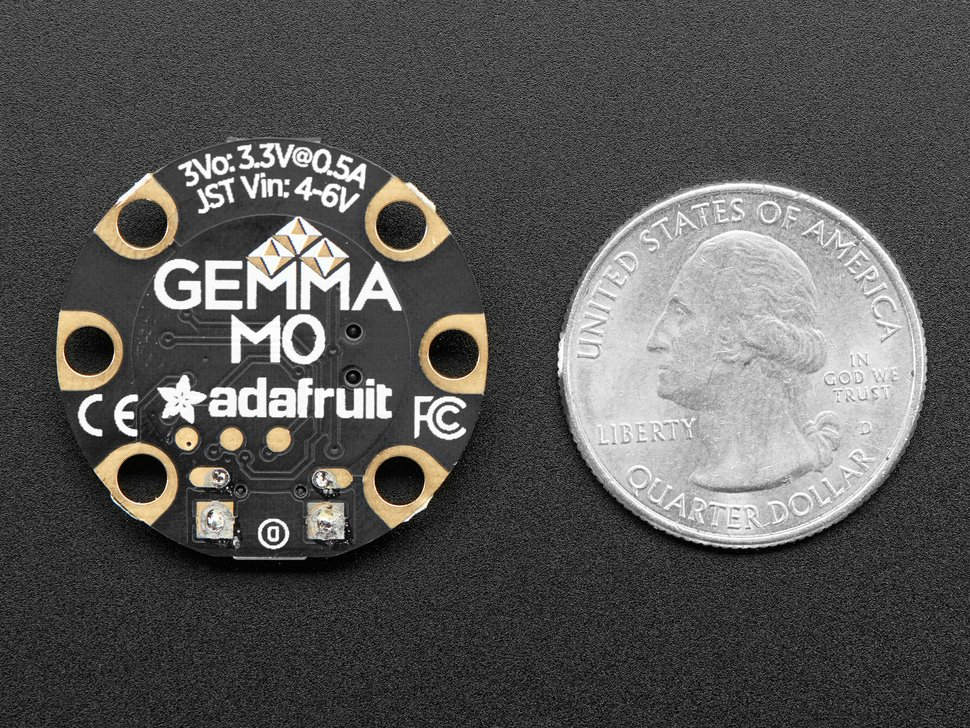
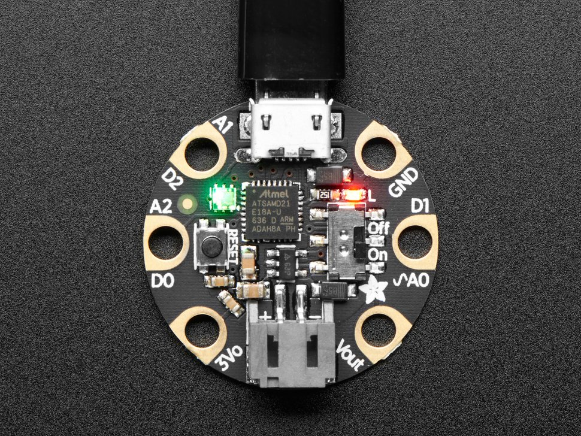

# Arduino to .NET Serial Communication
This is a sample of how to use C# to communicate with your Arduino via a USB Serial connection.

## Components
* C# via _Visual Studio 2019_
* [Arduino Gemma M0](https://www.adafruit.com/product/3501) from Adafruit
* [PlatformIO](https://platformio.org/) with VS Code
* USB connection

In this sample, I used the [Arduino GEMMA M0](https://www.adafruit.com/product/3501) by AdaFruit which uses the powerful _ATSAMD21E18_ over the older, ATtiny85. The Gemma is a miniature wearable electronic platform which you can pick up for just under $10 bucks. It's great for sewable

Here we're using [PlatformIO](https://platformio.org/) instead of the Arduino IDE. Why? Because Platform.IO's integration with VS Code delivers a more superior experience pound-for-pound over the official Arduino IDE based off of Processing.

# What's In The Box?!

When communicating with the **Gemma M0**, you must enable _Request to Send_ in your serial connection ``RtsEnable = true``.

```cs
  // Arduino Gemma M0 requires Request to Send to be TRUE
  _serialPort.RtsEnable = true;
```



(_Images by Adafruit_)

## New to PlatformIO
Check out this [YouTube video](https://www.youtube.com/watch?v=dany7ae_0ks) by *MakeUseOf* to guide you through the quick process.
